<div align="center">

# 👋 Hi, I'm Ethan Lane

[](https://github.com/TIANQIAN1238)
[](https://x.com/ethanlaneguy)
[](https://simen.ai/en)
[](https://viralkey.ai)
[](https://orcid.org/0009-0005-9243-4301)

**Full-Stack Developer @ [Simen AI](https://simen.ai/en)**

**Co-founder @ [Viralkey](https://viralkey.ai) · Core Member @ OpenDev · [NextChat](https://github.com/ChatGPTNextWeb/NextChat) 核心贡献者**

*Building AI-powered tools that transform words into actions ⚡*

</div>

---

## 🌊 关于我

```yaml
位置: 深圳 / 杭州 / 上海
组织:
  - simen-ai      # Simen AI（猴子说话）· 研发负责人
  - Viralkey      # 联合创始人 · 核心研发
  - OpenDev       # 核心成员 · 共建共创赞助计划负责人
学校: 中南财经政法大学（人工智能 + 会计学 双学位）
专注领域:
  - 全栈开发
  - AI 驱动的开发者工具
  - AI Agent 架构与大模型 API 网关
  - Electron / Swift 桌面应用
  - SaaS 出海
  - 动效与交互设计
兴趣爱好:
  - AI 工作流与自动化
  - 开发者体验 (DX)
  - 开源项目
  - 逆向工程与网络安全
```

全栈工程师，专注于 AI 驱动的开发者工具。从前端动效到后端架构，从数据库设计到 Electron 桌面应用，什么都搞。热衷于打造流畅、高效、有灵魂的产品体验。

白天在造轮子，晚上热衷「拆盲盒」（业余逆向 / 安全爱好者）。重度 Vibe Coding 依赖，靠咖啡和 Claude、Codex 续命。

## 💼 在做的事

### 🐒 Simen AI（猴子说话）· 研发负责人

作为创始团队核心成员全面负责研发，牵头研发团队从需求调研、技术选型、架构设计到部署上线全链路交付。公司获**锦秋基金近 4000 万元投资**，并入选光谷重点支持项目。

- **[Simen](https://simen.ai/en) · 桌面级 AI Agent** —— 主导整体架构与核心研发，基于 VS Code（Code-OSS）内核与 Electron + React 深度定制客户端；独立设计实现 Go 语言 AI 网关 `simen-ai-proxy`，统一接入多家主流大模型，落地 JWT 鉴权、多供应商路由、Token 精确计量与余额计费，支撑产品商业化收费链路
- **[Viceme](https://viceme.ai) · 云端多智能体平台** —— 作为核心架构师从 0 完成后端技术选型与架构规划，落地微服务化多智能体架构；设计任务编排与调度、服务间通信与实时数据推送方案，攻克高并发复杂调度下的稳定性难题
- **OnlineClaw · AI 客户端分发与自动化部署平台** —— 主导 Next.js 控制台、管理服务、代理服务、扫描器等多个子系统，打通「打包 → 分发 → 远程管理」一体化链路
- **飞书生态插件** —— 对接可灵、通义千问等多家大模型 API，让用户用自然语言直接调用文生图 / 文生视频 / 图像编辑

### 🌐 OpenDev · 核心成员 · 共建共创赞助计划负责人

OpenDev 是深耕 AI 模型资源与开发者生态的集团化团队（2017 年工作室起步，2020 年公司化经营），运营国内领先的模型资源路由服务 **AIRS**（[api.openai-next.com](https://api.openai-next.com)），与 FastGPT、NextChat、FishAudio、GPT Academic 等开源项目长期共创与赞助，并持续赞助和孵化开发者与创业团队。

- **模型资源** —— 深度参与 AIRS 平台的模型接入适配、资源池与配额管理、可用性监控与故障处置；主流模型官方接口发布后 **1 小时内**完成适配、压测并上线
- **赞助计划负责人** —— 负责面向开发者生态的模型资源赞助，落地 **AdventureX（独家模型资源赞助）**、**上海 WAIC**、**BEYOND Expo** 等活动的资源支持与技术对接；团队平均每周联办 / 协办 5–10 场开发者活动
- **[OpenAI Next Credits](https://credits.openai-next.com)** —— 主导研发赞助计划的支撑系统：面向黑客松、路演与工作坊的 LLM 额度管理平台（NestJS + Prisma + Next.js），并完成自建部署与 GitHub Actions 持续交付
- **开发者孵化** —— 为被孵化的 AI 项目免费或低价提供模型与算力资源，从早期就开始陪跑

### 🚀 [Viralkey](https://viralkey.ai) · 联合创始人 · 核心研发

面向海外 C 端市场的 AI 短视频与图像生成 SaaS，**已跑通订阅付费的盈利闭环**。Go 微服务后端（DDD 分层）+ Next.js 前端。

- **出海增长** —— 基于竞品拆解与搜索意图尽调设计落地页矩阵与内容体系，配合多语种站点覆盖长尾搜索，形成以自然搜索为核心的获客闭环
- **产品设计** —— 把高门槛的生成式能力收敛为普通用户直接上手的模板化工作流，主导 Music Video Agent（自动解析音轨节拍生成卡点视频）与电商营销素材 Studio
- **计费与模型路由** —— 设计 billing-credits 模块，接入 Airwallex / Stripe 跨境收单；统一接入 Seedance / Wan / Veo 等视频模型与 Suno 音乐生成，基于 Temporal 编排长耗时生成任务

## 🛠️ 技术栈

<div align="center">

| 前端 | 后端 | 桌面端 | AI & 工具 |
|:--------:|:-------:|:-------:|:----------:|
|  |  |  |  |
|  |  |  |  |
|  |  |  |  |
|  |  |  |  |
|  |  |  |  |
|  |  |  |  |
|  |  |  |  |
|  |  |  |  |

</div>

## 🚀 项目

<table>
<tr>
<td width="50%">

### 💬 [NextChat](https://github.com/ChatGPTNextWeb/NextChat)
轻量、快速的开源 AI 助手客户端，支持 Web / iOS / macOS / Android / Linux / Windows。作为核心贡献者参与项目建设。


</td>
<td width="50%">

### 🎬 [VibeClip-Pro](https://github.com/TIANQIAN1238/VibeClip-Pro)
跨平台剪贴板控制台，整合本地历史、AI 快捷操作与深色/浅色视觉体系，让"复制 → 处理 → 粘贴"变成一次呼吸间的流程。


</td>
</tr>
<tr>
<td width="50%">

### 🖥️ [control-your-mac](https://github.com/TIANQIAN1238/control-your-mac)
基于 AppleScript 的 MCP 服务器，让 AI 助手安全地自动化控制 macOS：应用与窗口、系统设置、文件、浏览器、日历与提醒等。


</td>
<td width="50%">

### 📝 [CodeBlog](https://codeblog.ai)
面向 Agent 的开发者社区：让你的 Cursor / Claude Code / Codex 自主记录笔记、沉淀经验、相互交流。出于安全考虑核心服务端暂不开源，[Swift 原生 macOS 客户端](https://github.com/CodeBlog-ai/codeblog-mac)与 [App](https://github.com/CodeBlog-ai/codeblog-app) 完整开源。


</td>
</tr>
<tr>
<td width="50%">

### 🎨 [codex-skin-gallery](https://github.com/TIANQIAN1238/codex-skin-gallery)
免费、开源、可恢复的 Codex Desktop 社区皮肤图鉴。


</td>
<td width="50%">

### 🐞 [bugme](https://github.com/TIANQIAN1238/bugme)
Bug 复现流程录制与分享工具：Chrome 扩展自动捕获每一次点击、跳转与输入，生成带标注截图的分步指南，一个链接就能把问题讲清楚。


</td>
</tr>
<tr>
<td width="50%">

### 🤖 [newapi-ai-check-in](https://github.com/TIANQIAN1238/newapi-ai-check-in)
基于 NewAPI 的站点自动签到脚本，让 AI 积分自动到账。


</td>
<td width="50%">

### 🔄 [cursor-account-switcher](https://github.com/TIANQIAN1238/cursor-account-switcher)
Cursor 账号无感切换管理器，基于 Rust 构建，轻量高效。


</td>
</tr>
</table>

### 🌟 开源贡献

- **[ChatGPTNextWeb/NextChat](https://github.com/ChatGPTNextWeb/NextChat)** - 核心贡献者，参与工程质量建设：为核心工具函数与 MCP 模块建立单元测试体系，完善多模型供应商（Azure OpenAI、DeepSeek 等）的环境变量与部署文档，并参与 NextChat 服务端账单同步等后端优化
- **[community/community](https://github.com/community/community)** - GitHub 官方社区讨论，参与 GitHub Mobile、Codespaces、Sponsors 等产品反馈
- **[CKylinMC/PasteMe](https://github.com/CKylinMC/PasteMe)** - AI 加持的剪贴板工具

## 📊 GitHub Stats

<div align="center">
  
  
</div>

<div align="center">
  
</div>

## 🎯 当前关注

- 🔭 在 **Simen AI** 构建下一代 AI 工作引擎，让 AI 理解你的需求并为你操作
- 🌐 在 **OpenDev** 推动模型资源赞助计划，支持更多黑客松与开发者、孵化 AI 创业团队
- 🚀 带 **Viralkey** 出海，把生成式 AI 做成普通人也能上手的产品
- ✨ 探索 **Agent** 与自动化工作流，打造真正的 AI 助手
- 🎨 追求极致的交互体验与动效设计
- 🤝 开放合作，欢迎交流创新的开发者工具想法

## 📫 联系我

<div align="center">

[](https://simen.ai/en)
[](https://viralkey.ai)
[](https://x.com/ethanlaneguy)
[](https://wa.me/8615623121059)

[](mailto:1124774683@qq.com)
[](mailto:zhaojinsong03@gmail.com)

</div>

---

<div align="center">

*"Coding from everywhere! 🌊"*


</div>
